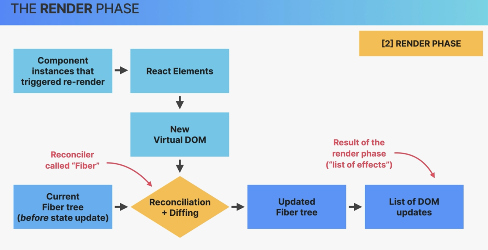
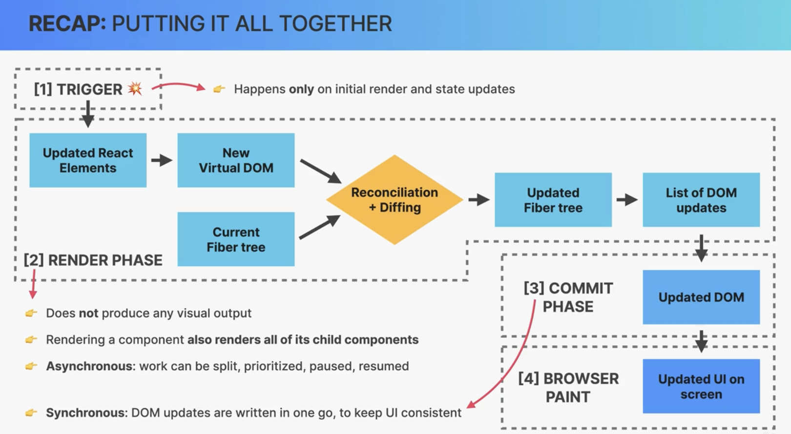
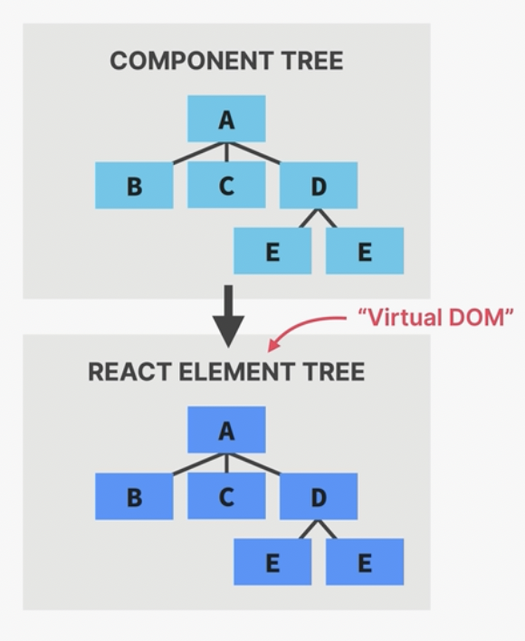
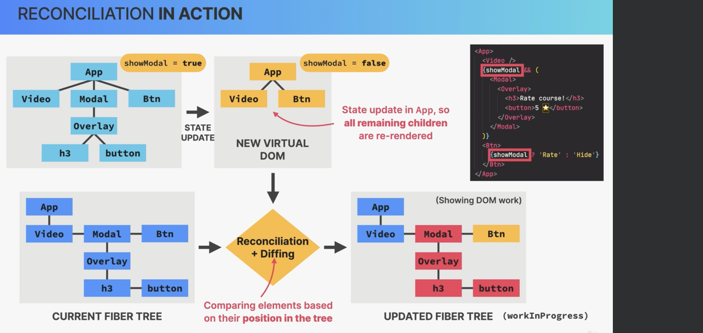

# React behind the scenes

## Component

    - It is a blue print of how we want a part of the UI to look like.
    - When a component is created we say that we have a physical manifestation
    - Has its own state and props
    - Has its own life cycle (born, live, die).

## React element

The result of `React.createElement()` calls that are inserted to the DOM

## Component properties

- `$$typeof: Symbol(react.element)`: `Symbol()` cannot be transmitted via JSON to protecting us again (cross side scripting).
- if, we call a component us `Component()`, React does not recognize it as a component.

## React Flow

1. components function
2. create component instances
3. each jsx produces `createElement()` calls
4. transformed to DOM elements
5. displayed as a user interface on the screen

## Render process

1. Triggers a render phase (state)
2. Render phase starts
   - happens internally, no visual changes
3. Commit phase
   - where React actually writes to the DOM.
4. Browser paint

## Step 1 Render trigger

- ways that can we can trigger a re render

  - Initial render
  - State update
    - new state is available after the re render
    - SetTimeouts, Promises, Native Events batch inner state updates after React18+ **Automatically**
    - `ReactDOM.flushSync(() => {})`, excludes the function from being batched.
    - Even if we update state, if the values are the same as the old, then there is no re render

- _This trigger is for the entire application_
- _A render is triggered for the JS to execute when it has some free time_
- _There are situations, of multiple `setState` called `batching`_

### Render phase

1. Take all the component instances that triggered a re render and re execute them to make up the V-DOM.
   - Whenever React re executes the instance of an element, it will cause all its children components to be rendered (even if props or state are the same).
     
     cheap and fast

## Step 2. `Reconciliation`

In the reconciler process called `Fiber`, walks through the entire tree and analyzes step by step, between the current and updated fiber tree `Fiber tree`. **(Diffing)**

**Reconciliation process** - 

### Fiber, Reconciliation (Heart oF React)

- _Fiber, is the internal tree, (mutable DS), that has a "fiber" for each component instance and DOM element._
- **Reconciliation**: Deciding which DOM elements actually need to be inserted, deleted, or updated, in order to reflect the latest state changes.

**Fiber (Unit of work), (Node in a Linked List)**

- Current state
- Props
- Side effect
- Used hooks
- Queue of work
- **work can be done async**
  - (rendering can be split into chunks
  - tasks can be prioritized
  - work can be paused
  - reused an thrown away
- Enables `concurrent` features like `Suspense` or `transitions`
- Rendering process to pause and resume later and it doesn't block the js engine with te long renders

### Diffing

- Assumptions

  1. Two elements of different types will produces different trees
     - React assumes entire sub-tree is no longer valid. Old components are destroyed and removed from the DOM and the state oof that sub-tree.
  2. Elements with a stable key prop stay the same across renders
     - Element will be kept (as well its the sub-tree), including their state.
       - New props / attributes are passed if they changed between renders

  #### Key prop

  Special prop that we can use to tell the Diffing algorithm that a certain element is unique
  _When a key of a certain element changes, the element will be destroyed and a new one will take its place_

  - Use cases:

    - Using keys in list
    - Using keys to reset state (changing keys also resets state and generates a new component)

  - Bad practices
    - Not using keys: removes and recreates elements in the DOM (bad for performance)

## Step 3 Commit phase (ReactDOM, React Native, Remotion (videos), Electron)

- Insertion, deletions, and updates to the DOM.
- This phase is synchronous, (necessary so that the DOM doesn't show partial results).
- After the phase completes, the `workInProgress` fiber tree becomes the current tree for the next render cycle.

## Rules for render logic

No interaction with the outside world is allowed when it comes down to render logic

- Do not perform network requests
- Do not start timers
- Do not directly use the DOM API
- Do not mutate objects or variables that are outside of the function scope
- Do not update state or refs in render logic

## Side effects

- Allowed in
  - Event handler functions
  - `useEffect`.
