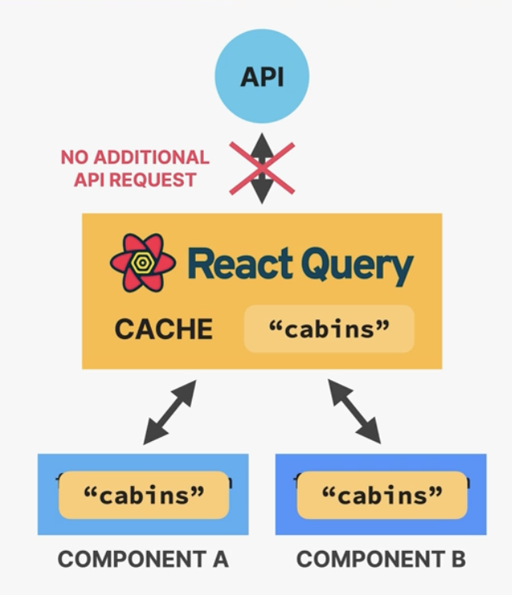

# React Query

Management library for remote (server) state



## Advantages

1. Data is stores in cache
2. Automatic loading and error states
3. Automatic re-fetching to keep state synced
   - A certain timeout
   - Leave the browser window and then come back to it
4. Pre-fetching
   - Pagination
5. Easy remote state mutation
6. Offline support
   _Remote State is different from UI State_

## Set up

```ts
const queryClient = new QueryClient({
  defaultOptions: {
    queries: {
      staleTime: 60 * 1000,
    },
  },
});
```

```tsx
const App = () => {
  return (
    <QueryClientProvider client={queryClient}>
      <ReactQueryDevtools initialIsOpen={false} />
      <BookingList />
      <CabinList />
    </QueryClientProvider>
  );
};
```

```ts
const {
  data: cabins,
  isLoading,
  error,
} = useQuery({
  queryKey: ["cabins"],
  queryFn: () =>
    axios
      .get("http://localhost:3000/cabins")
      .then((res) => res.data)
      .catch((e) => {
        console.log("there was an error: ", e);
      }),
});
```

## Mutations

```tsx
const { mutate } = useMutation({
  mutationFn: deleteCabin,
  onSuccess: () => {
    queryClient.invalidateQueries({ queryKey: ["cabins"] });
  },
  onError: (error) => {
    alert(error.message);
  },
});
```
